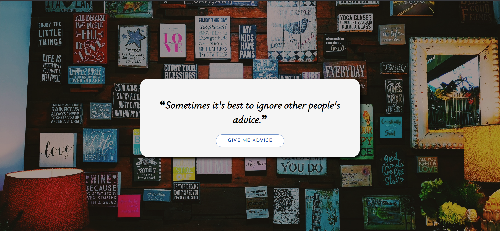

# Random Quote Generator - React

A web application built with React.js that displays random quotes fetched from the adviceslipjsonapi.

## Features

- Generate Random Quotes: Get inspirational and thought-provoking quotes with a click of a button.
- Responsive Design: Enjoy a seamless user experience on different devices and screen sizes.

## Technologies Used
- React.js
- CSS
- adviceslipjsonapi

# Usage
- Click the "Generate Quote" button to display a new random quote.
- Use the social media icons to share the current quote on various platforms.

# API Usage
The project utilizes the adviceslipjsonapi to fetch random quotes. Visit the adviceslipjsonapi documentation to explore more about the API and its usage.

# Contributing
Contributions are welcome! If you have any suggestions, bug reports, or feature requests, please open an issue or submit a pull request.
## Demo

[HERE](https://randomquotegenerator-dex.netlify.app/)

## Screenshots



## Installation

1. Clone the repository:
   ```shell
   git clone https://github.com/VIRUS-XDD/Random-Quote-Generator-React.git

2. Install the dependencies:

   ```shell
   npm install

3. Start the development server:
   ```shell
   npm start

4. Open the app in your browser at http://localhost:3000.   
